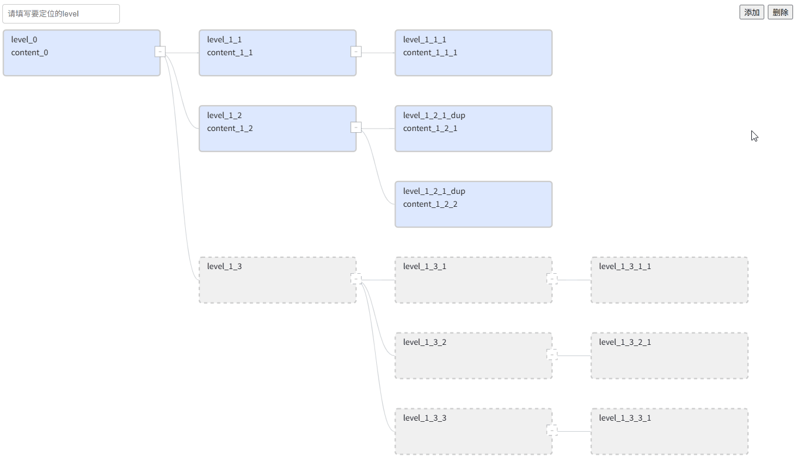

# G6 Template Tree Editor

基于 [AntV G6 4.x](https://g6-v4.antv.vision/) 的树图TreeGraph实现，用于在一个结构已知的树图模板中动态增删内容节点。

适用于结构模板固定、但需要内容更新的场景，例如 BOM（物料清单）等。

## ✨ Feature

- 🛠️ 基于模板树进行内容节点/树的添加与删除
*节点添加*

*节点删除*

- 🎯 快速定位并高亮节点
*节点定位并高亮*

- 📂 主动折叠、展开、全部展开
*节点展开/折叠*

## 🚀 快速开始
npm install
npm run dev