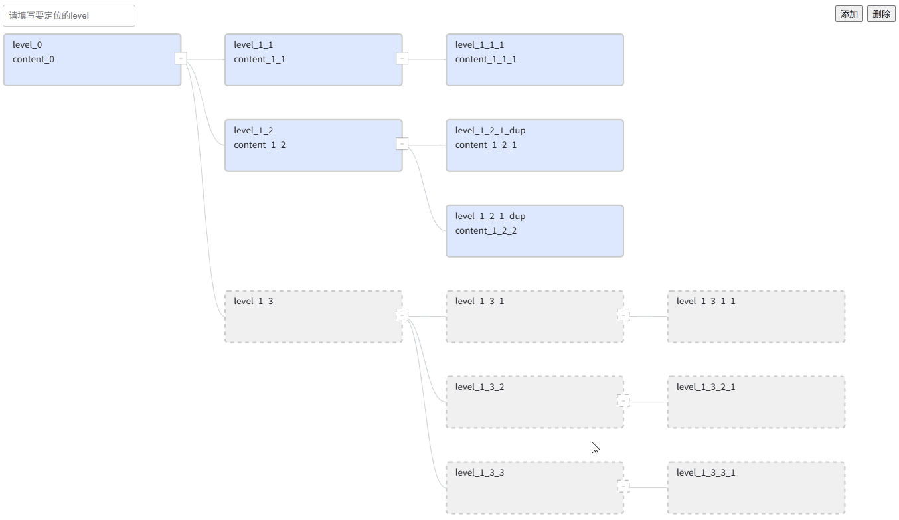

# G6 Template Tree Editor

基于 [AntV G6 4.x](https://g6-v4.antv.vision/) 的树图TreeGraph实现，用于在一个结构已知的树图模板中动态增删内容节点。

适用于结构模板固定、但需要内容更新的场景，例如 BOM（物料清单）等。

## ✨ Feature

- 🛠️ 基于模板树进行内容节点/树的添加与删除
<figure style="text-align: center;">
  
  <figcaption style="font-size: 14px; color: #555;margin-top: 10px;">节点添加</figcaption>
</figure>
<figure style="text-align: center;">
  
  <figcaption style="font-size: 14px; color: #555;margin-top: 10px;">节点删除</figcaption>
</figure>
- 🎯 快速定位并高亮节点
*节点定位并高亮*
<figure style="text-align: center;">
  
  <figcaption style="font-size: 14px; color: #555;margin-top: 10px;">节点定位并高亮</figcaption>
</figure>
- 📂 主动折叠、展开、全部展开
<figure style="text-align: center;">
  
  <figcaption style="font-size: 14px; color: #555;margin-top: 10px;">节点展开/折叠</figcaption>
</figure>

## 🚀 快速开始
npm install
npm run dev